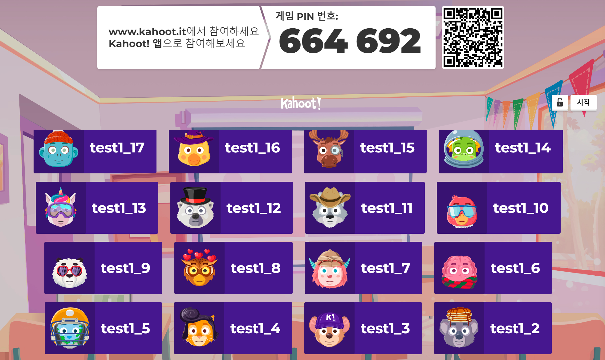

## Kahoot Api Wrapper
Developer: gagol(logag1)


### LICENSE
MIT LICENSE `LICENSE.md`

### Use
아래와 같이 Kahoot 클라이언트를 만든 뒤 `addBot` 함수를 사용해 봇을 방에 참여시킬 수 있습니다.

300~400ms의 딜레이를 추천드리며 딜레이 코드는 모듈 내에서 확인하실 수 있습니다.

```typescript
import { Kahoot, IAccount } from './src';
import { Utilities } from './src';

(async () => {
  const kahoot = new Kahoot("KAHOOT_ROOM_CODE");
  const addRes = await kahoot.addBot("BOT_NICKNAME");

  console.log('Add Result', addRes);

  await Utilities.delay(200);
})();
```

`addBot` 함수는 비동기로써 아래와 같은 정보를 반환합니다

```typescript
Promise<{ success: boolean, account: IAccount }>
```

- Kahoot 클라이언트 내부에서 프로세스가 돌아가는 동안 봇의 연결을 유지하기 위한 polling을 반복적으로 전송합니다.
- WebSocket을 통한 클라이언트 연결은 아직 지원하지 않습니다. 현재는 Http RestApi를 통한 연결만을 사용합니다.